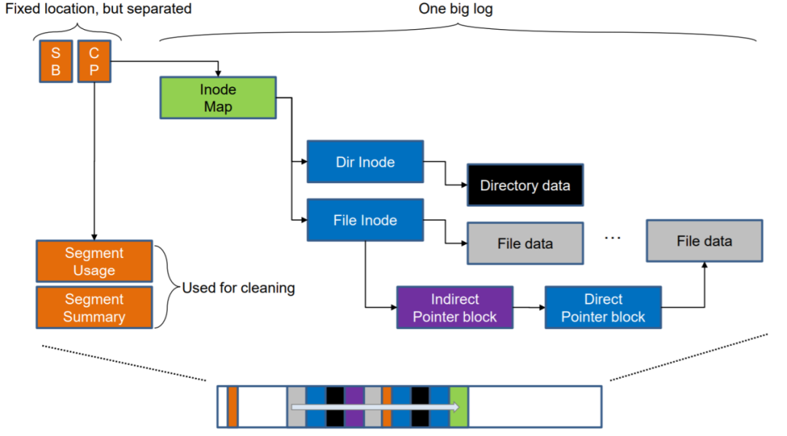

https://zhuanlan.zhihu.com/p/633912610

简历上提到的nfs acl问题？

https://www.cnblogs.com/Linux-tech/p/12961293.html
总结一下这篇文章

这篇文章中提到F2FS (Flash Friendly File System) 是专门针对SSD、eMMC、UFS等闪存设备设计的文件系统，SSD、eMMC、UFS已经有FTL去做地址映射、磨损均衡、坏块管理等事情，那F2FS还需要关注数据搬移、碎片管理、GC之类的事情吗，F2FS和FTL的分别要做哪些事情
相比较ext4这种本地文件系统，F2FS的“Flash Friendly”体现在哪些方面呢？

这篇文章提到“以更新一个文件的内容为例：先写入文件数据内容，再更新各级索引块，最后还要更新Inode Map”，如果写入的文件数据不足一个块，要怎么处理

F2FS的check point area什么时候更新，怎么更新的，举个例子

分别举例子说明SIT/NAT/SSA的用途和更新流程

这张日志结构文件系统索引结构和数据更新示意图我没看懂，解释一下